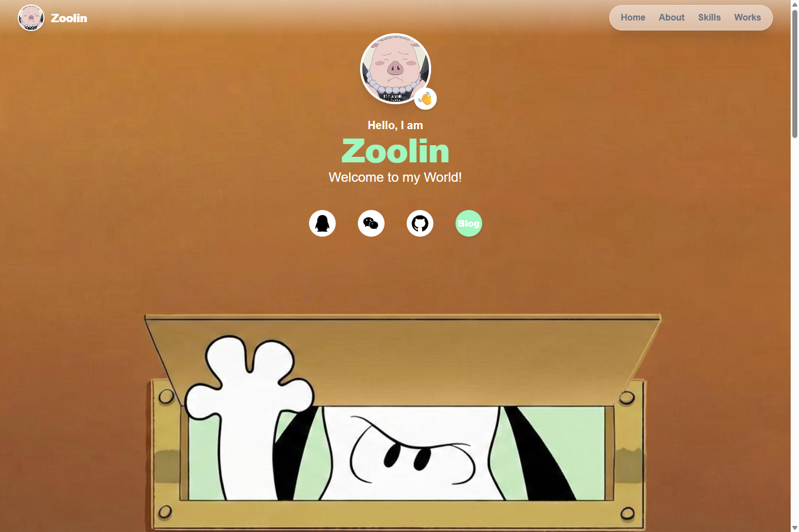
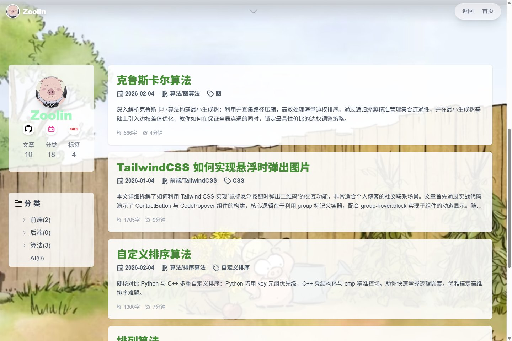

<div align="center">


## 🌐 网站地址：[https://zoolin.top](https://zoolin.top)

**一个记录前端探索、算法练习与学习日常的个人空间。**

[访问主页](https://zoolin.top) · [阅读博客](https://zoolin.top/blog) · [文章源码](app/blog/posts) · [反馈问题](https://github.com/zzzzzooooo8/zzzzzooooo8.github.io/issues)


[](https://github.com/zzzzzooooo8/zzzzzooooo8.github.io/actions/workflows/deploy.yml)

</div>

## 关于这个小站

Hello, I am **Zoolin**. Welcome to my World!

这里既是我的个人主页，也是边学边写的技术笔记本。从一个页面的交互，到一道算法题的思路，再到开发环境里踩过的坑，把学习过程慢慢整理成可以回看的文字。

- **个人主页**：自我介绍、学习中的技能与作品展示区域。
- **技术博客**：使用 Markdown 写作，通过 MDX 渲染正文与代码块。
- **分类浏览**：树形分类导航，整理前端、后端、算法与 AI 等主题。
- **阅读信息**：展示文章日期、标签、字数和预计阅读时长。
- **视觉风格**：自然插画背景、浅色半透明卡片，以及适配手机的布局。
- **静态部署**：通过 Next.js 静态导出，由 GitHub Actions 部署到 GitHub Pages。

## 页面一览

<table>
  <tr>
    <th width="50%">个人主页 · Hello, world</th>
    <th width="50%">文章列表 · Learn in public</th>
  </tr>
  <tr>
    <td><a href="https://zoolin.top"></a></td>
    <td><a href="https://zoolin.top/blog"></a></td>
  </tr>
</table>

<sub>截图来自线上站点，拍摄于 2026-09-08；展示内容可能与当前源码不同。</sub>

## 从这里开始读

| 方向 | 笔记 | 内容 |
| :--- | :--- | :--- |
| React / Next.js | [“use client” 与 “fs”](app/blog/posts/useclientVSfs.md) | 客户端与服务端的边界，以及组件拆分 |
| CSS 交互 | [Tailwind CSS 悬浮弹出图片](app/blog/posts/TailwindCSS-hover-position.md) | 用 `group-hover` 实现悬浮提示 |
| 图算法 | [克鲁斯卡尔算法](app/blog/posts/MST.md) | 最小生成树与并查集 |
| 开发环境 | [Python 虚拟环境](app/blog/posts/virtual-environment.md) | 依赖隔离，以及 pip、conda 和 uv 的使用 |

## 本地运行

使用 Node.js 20.9+ 和 pnpm 10；仓库现有部署流程使用 Node.js 20 与 pnpm 10。

```bash
git clone https://github.com/zzzzzooooo8/zzzzzooooo8.github.io.git
cd zzzzzooooo8.github.io
pnpm install --frozen-lockfile
pnpm dev
```

打开 [localhost:3000](http://localhost:3000) 查看页面。

| 命令 | 用途 |
| :--- | :--- |
| `pnpm dev` | 启动本地开发服务 |
| `pnpm build` | 构建并导出静态站点到 `out/` |
| `pnpm lint` | 运行 ESLint 检查 |

项目启用了 `output: 'export'`，构建产物应通过静态文件服务器预览；`next start` 不适用于此导出模式。

## 写一篇文章

在 `app/blog/posts/` 下新建 `.md` 文件。文件名会成为文章地址，例如 `hello-world.md` 对应 `/blog/hello-world`。

```markdown
---
title: 我的第一篇笔记
date: 2026-09-08
description: 记录一个刚刚弄懂的小问题。
category: 前端/React
tags: React/Next.js
---

## 今天学到了什么

从一个小问题开始，把思路写下来。
```

分类和标签使用 `/` 分隔。新增分类时，同步维护 `app/blog/categoryData.ts` 中的分类树；文章的字数与阅读时长由程序自动计算。

文章图片放在 `public/` 下，通过 `` 引用。提交前运行 `pnpm build`，检查文章能否正常导出。

<details>
<summary><strong>项目结构</strong></summary>

```text
.
├── app/
│   ├── page.tsx                 # 个人主页
│   ├── layout.tsx               # 全局布局
│   ├── globals.css              # 全局样式
│   └── blog/
│       ├── page.tsx             # 博客首页
│       ├── posts/               # Markdown 文章
│       ├── posts.tsx            # 文章读取与阅读统计
│       ├── [slug]/page.tsx       # 文章详情
│       ├── category/[slug]/     # 分类页面
│       ├── categoryData.ts      # 分类树配置
│       └── components/          # 博客组件
├── public/                      # 插画、头像与文章图片
├── .github/
│   ├── assets/                  # README 封面与截图
│   └── workflows/deploy.yml     # GitHub Pages 部署
└── next.config.ts               # 静态导出配置
```

</details>

<details>
<summary><strong>部署说明</strong></summary>

仓库已有 [GitHub Pages 工作流](.github/workflows/deploy.yml)：推送到 `main` 分支或手动运行工作流后，安装依赖、构建 `out/` 并部署。仓库的 **Settings → Pages → Build and deployment → Source** 需要选择 **GitHub Actions**。

如果部署到带有仓库子路径的地址，需要根据实际路径调整 `next.config.ts`，并检查以 `/` 开头的图片和页面链接。

</details>

---

<div align="center">

**慢慢学，认真写。**

<sub>Made by <a href="https://github.com/zzzzzooooo8">Zoolin</a> · Built with Next.js</sub>

</div>
